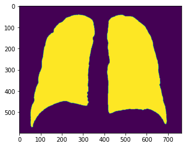
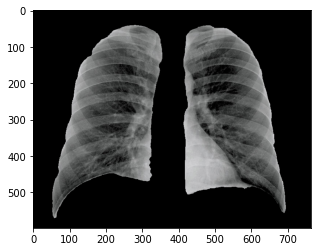
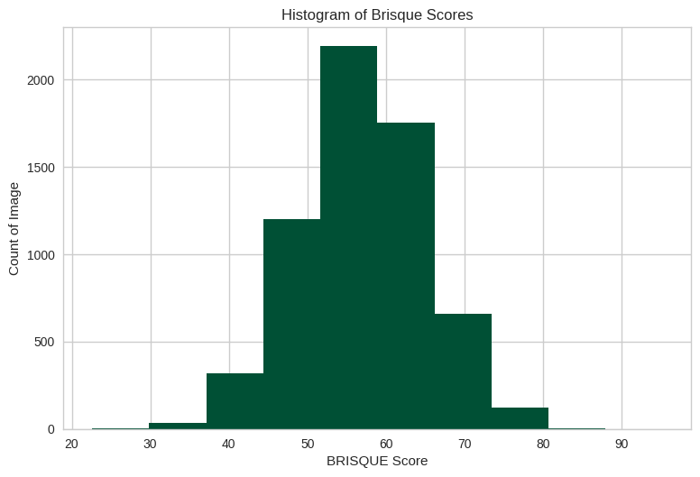
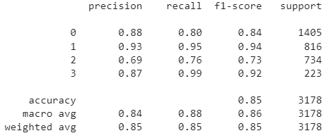
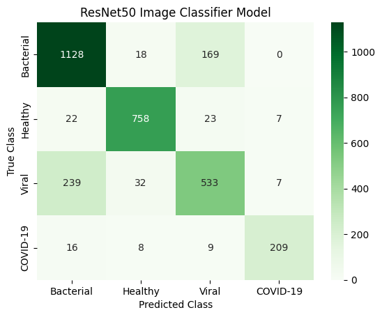
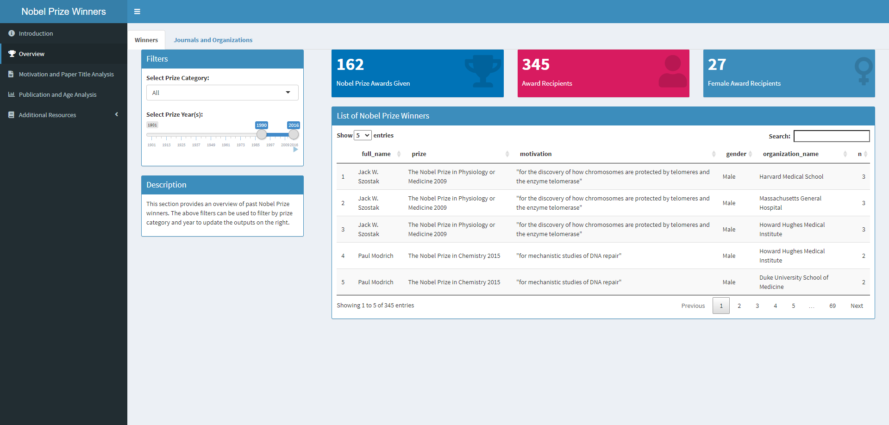
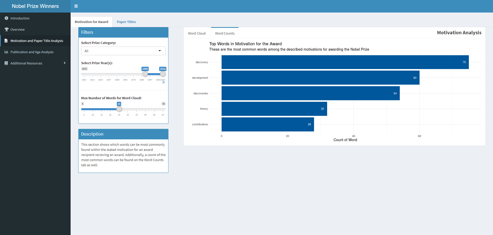
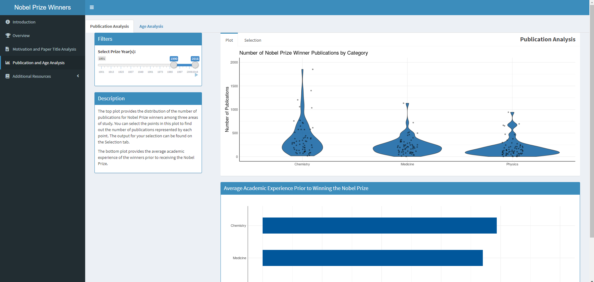

# My Portfolio

## Table of Contents

- Python Projects
  - [Detecting COVID-19 using Chest X-rays](#detecting-covid-19-using-chest-x-rays)
  - [Detecting COVID-19 Misinformation on Social Media](#detecting-covid-19-misinformation-on-social-media)
  - [Text Analysis and Mining Example](#text-analysis-and-mining-example)
- R Projects
  - [Shiny Application Project](#shiny-application-project)
- Tableau Projects
  - [Undergraduate Student Outcomes Dashboard](#undergraduate-student-outcomes-dashboard)
  - [MBA Class Profile Dashboard](#mba-class-profile-dashboard)

---

## [Detecting COVID-19 using Chest X-rays](https://github.com/joshapeterson/My-Portfolio/tree/main/image-classification-project)

### Overview

**Goal of Project**: Develop a deep learning model to accurately detect COVID-19 using chest x-ray images

The purpose of this project was to create a deep learning model that accurately detects COVID-19 and other types of pneumonia using chest x-rays. Many of the existing models are trained on chest x-ray images of lungs and surrounding areas of the chest. In this project, we train a model on masked chest x-ray images to remove unwanted artifacts of the image so the model can focus on the vital parts of the image. 

***Image Preparation and Selection***

The image masks were created using x and y coordinates provided for each image in the dataset. The following is an example of the masks created for the chest x-ray images:



The masks were then applied to each of the chest x-ray images via a bitwise and operation. The following is an example of a masked chest x-ray image:



Additionally, image quality of the chest x-rays was assesed via BRISQUE scores. The following is the distribution of those scores:



Images with a BRISQUE score higher than Q3 of the interquartile range were removed from the dataset to minimize the effect poor quality images would have on the performance of the deep learning image classification model. 

***Model Development***

Multiple deep learning architectures for this image classification task were tested. In the end, our best performing model used the ResNet50 architecture to classify the x-ray images. 

```
class_model_base = keras.applications.ResNet50(weights="imagenet", include_top=False)
```

The ResNet50 architecture was fine-tuned for our image classification task. This was accomplished by making the weights in the last 32 layers trainable. 

```
class_model_base.trainable = True

for layer in class_model_base.layers[:-32]: # making the last 32 layers of the ResNet50 model trainable
  layer.trainable = False

print("The number of trainable weights in the pretrained model:", len(class_model_base.trainable_weights))
```

The following was the deep learning model developed using the ResNet50 architecture:

```
data_augmentation = keras.Sequential(
    [
        layers.RandomRotation(0.1, fill_mode='constant',fill_value=0),
        layers.RandomZoom(0.1),
        layers.RandomTranslation(0.1,0.1,fill_mode='constant',fill_value=0),
    ]
)

inputs = keras.Input(shape=(200, 200, 3))
x = layers.Rescaling(1./255),
x = data_augmentation(inputs)
x = keras.applications.resnet50.preprocess_input(x)
x = class_model_base(x) # using the ResNet pre-trained model as the base for my image classification model
x = layers.Flatten()(x)
x = layers.Dense(512, activation=tf.nn.relu)(x)
x = layers.Dropout(0.2)(x) # Used a dropout rate of 0.2 to regularize the model
outputs = layers.Dense(nb_classes, activation=tf.nn.softmax)(x)
model = keras.Model(inputs, outputs)

model.compile(optimizer = 'adam', 
              loss = 'sparse_categorical_crossentropy', 
              metrics = ['accuracy'])

callbacks = [
    keras.callbacks.ModelCheckpoint(
        filepath="resnet50_im_class_model.keras",
        save_best_only=True,
        monitor="val_loss")
]

history = model.fit(train_images, 
                    train_labels, 
                    batch_size=128, 
                    epochs=40, 
                    validation_split = 0.2,
                    callbacks=callbacks)
```

***Model Results***

This model acheived an accuracy of 85%. The following is a classification report from the model:



*Note: 0 = Bacterial Pneumonia, 1 = Healthy, 2 = Viral Pneumonia, 3 = COVID-19*

***Future Work***

When conducting an error analysis of the developed model, it was seen that the most confusion in the model arose when trying to distinguish between viral pneumonia and bacterial pneumonia. This is represented in the confusion matrix below and the lower F1-score for those classes in the classification report.  



Future work would involve exploring ways to improve the performance of this model on these classes. 

### Data Source

V7 Labs. Available from: https://darwin.v7labs.com/v7-labs/covid-19-chest-x-ray-dataset/overview

### Authors

* Joshua Peterson
* Michael Gray
* Mangala Desai

### List of Primary Packages Used

numpy, pandas, tenserflow, keras, matplotlib, seaborn and imquality

### 🔗 [Link to Project Code](https://github.com/joshapeterson/My-Portfolio/blob/main/image-classification-project/image-classification-project_code.ipynb)

*[Back to Table of Contents](#table-of-contents)*

---

## [Detecting COVID-19 Misinformation on Social Media](https://github.com/joshapeterson/My-Portfolio/tree/main/misinformation-detection-project)

### Overview

### Data Sources

Cui, L., & Lee, D. (2020). CoAID: COVID-19 Healthcare Misinformation Dataset. Retrieved from http://arxiv.org/abs/2006.00885 

Memon, S. A., & Carley, K. M. (2020). Characterizing COVID-19 misinformation communities using a novel Twitter dataset. Retrieved from http://arxiv.org/abs/2008.00791  

Shahi, G. K., Dirkson, A., & Majchrzak, T. A. (2021). An exploratory study of COVID-19 misinformation on Twitter. Online Social Networks and Media, 22(100104), 100104. doi:10.1016/j.osnem.2020.100104 

*Note: These are all datasets containing labeled tweets that I hydrated using the tweet IDs* 

### Author

Joshua Peterson

### List of Primary Packages Used

numpy, pandas, seaborn, matplotlib, nltk, sklearn, xgboost, os, pickle, collections

### 🔗 [Link to Project Code](https://github.com/joshapeterson/My-Portfolio/blob/main/misinformation-detection-project/misinformation-detection-project_code.ipynb)

*[Back to Table of Contents](#table-of-contents)*

---

## [Text Analysis and Mining Example](https://github.com/joshapeterson/My-Portfolio/tree/main/text-mining-and-analysis-example)

### Overview

I was invited to give a talk to the M.S. in Data Science and Business Analytics program's Advanced Business Analytics class to discuss text mining and analysis methods. During the talk, an example of how to apply various text mining and analysis methods to Twitter data was provided. The code from this talk can be found [here](https://github.com/joshapeterson/My-Portfolio/blob/main/text-mining-and-analysis-example/text-analysis-and-mining-example_code.ipynb).

**Topics Covered**

- Text Preprocessing
- Text Cleaning
- Term Frequencies
- Word Clouds
- Sentiment Analysis
- Part-of-Speech Tagging
- Topic Modeling

### Author

Joshua Peterson

### List of Primary Packages Used

pandas, numpy, re, nltk, collections, itertools, sklearn, matplotlib, seaborn, wordcloud and textblob

### 🔗 [Link to Example Code](https://github.com/joshapeterson/My-Portfolio/blob/main/text-mining-and-analysis-example/text-analysis-and-mining-example_code.ipynb)

*[Back to Table of Contents](#table-of-contents)*

---

## [Shiny Application Project](https://github.com/joshapeterson/My-Portfolio/tree/main/shiny-application-project)

### Overview

The goal of this project was to build a shiny application that could provide a general overview of previous Nobel Prize winners. Creating a tool that could be used to assist institutions with future decisions regarding who to award the Nobel Prize.

First, a general overview of Nobel Prize winners as well as the journals and organizations associated with those winners was provided. 



Next, an analysis of previous award motivations and titles of winning papers was provided to understand the drivers of previous Nobel Prize awards. 



Finally, additional information about Nobel Prize winners was analyized such the number of publications they had, average years of academic experience, and age. 



All of this information can help us better understand previous Nobel Prize award winners.

### 🔗 [Link to Shiny App](https://japeterson.shinyapps.io/updated-app/)

### Authors

* Joshua Peterson
* Dipin Kasana
* Kelly O'Shields

### Data Source

Kaggle. Available from: https://www.kaggle.com/datasets/nobelfoundation/nobel-laureates

### List of Primary Packages Used

shiny, shinydashboard, tidytext, wordcloud, ggplot2 (Developer Version), RColorBrewer, tidyverse, validate, hrbrthemes, waiter and DT

### 🔗 [Link to Project Code](https://github.com/joshapeterson/My-Portfolio/blob/main/shiny-application-project/app.R)

*[Back to Table of Contents](#table-of-contents)*

---

## Undergraduate Student Outcomes Dashboard

This is a dashboard that was created for the Belk College of Business to display outcomes data from undergraduate level graduates of the college. This dashboard was created using data from UNC Charlotte’s [First Destination Survey](https://firstdestination.charlotte.edu/).

### 🔗 [Link to Dashboard](https://belkcollege.charlotte.edu/about-us/facts-and-rankings/undergraduate-student-outcomes/undergraduate-student-outcomes-2022)

*[Back to Table of Contents](#table-of-contents)*

---

## MBA Class Profile Dashboard

This is a student profile built for UNC Charlotte’s MBA program to provide admissions info to the public concerning the program’s Fall entering classes.

### 🔗 [Link to Dashboard](https://mba.charlotte.edu/admissions/class-profile)

*[Back to Table of Contents](#table-of-contents)*

