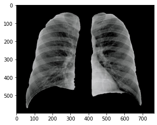
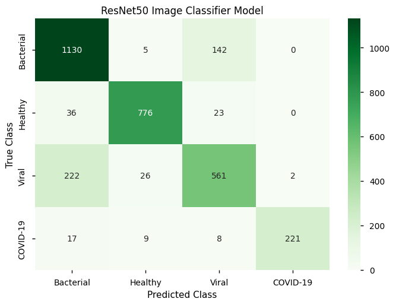

# Detecting COVID-19 using Chest X-rays

## Overview

**Goal of Project**: Develop a deep learning model to accurately detect COVID-19 using chest x-ray images

The purpose of this project was to create a deep learning model that accurately detects COVID-19 and types of pneumonia using chest x-rays. Many of the existing models are trained on entire chest x-ray images and perform only a binary classification to detect COVID-19. In this project, we train a model on masked chest x-ray images to remove unwanted artifacts or areas of the x-ray image and perform multiclass classification to label an image as containing evidence of COVID-19 or types of pneumonia. The final developed deep learning model acheived an accuracy of 85%. Error analysis of the model indicated that most confusion arose due to the model misclassifying bacterial and viral pneumonia x-rays more often than other classes. Therefore, future work would involve improving the performance of this model on these classes. 

***Example of Image Masking***

The image masks were created using x and y coordinates provided for each image in the dataset. The following is an example of the masks created for the chest x-ray images:

The masks were then applied to each of the chest x-ray images via a bitwise and operation. The following is an example of a masked chest x-ray image:

***Model Results***

This model acheived an accuracy of 85%. The following is a classification report from the model:

*Note: 0 = Bacterial Pneumonia, 1 = Healthy, 2 = Viral Pneumonia, 3 = COVID-19*

***Future Work***

When conducting an error analysis of the developed model, it was seen that the most confusion in the model arose when trying to distinguish between viral pneumonia and bacterial pneumonia. This is represented in the confusion matrix below and the lower F1-score for those classes in the classification report.  

Future work would involve exploring ways to improve the performance of this model on these classes. 

## Data Source

V7 Labs. Available from: https://darwin.v7labs.com/v7-labs/covid-19-chest-x-ray-dataset/overview

## Authors

* Joshua Peterson
* Michael Gray
* Mangala Desai

## List of Primary Dependencies

numpy, pandas, tenserflow, keras, matplotlib, seaborn and imquality

## 🔗 [Link to Project Code](https://github.com/joshapeterson/My-Portfolio/blob/main/image-classification-project/image-classification-project_code.ipynb)

*[Back to Portfolio](https://github.com/joshapeterson/My-Portfolio)*
