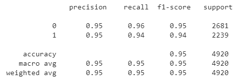
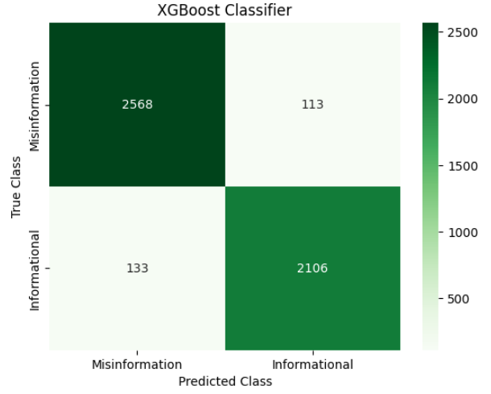

# Detecting COVID-19 Misinformation on Social Media

## Overview

***Abstract***

Throughout the COVID-19 pandemic, social media platforms were and continue to be a prevalent method 
for spreading misinformation related to the pandemic. The need for misinformation detection models and 
methods was and is necessary to combat this misinformation spread. The purpose of this research is to 
develop models that are able to detect misinformation on social media platforms. In addition to detecting 
misinformation, we also explore methods for determining the intent of that misinformation so the 
maliciousness and severity of the detected misinformation can be better understood. This natural language 
processing task will employ both machine learning and deep learning based models and methods as well as 
exploring the use of zero-shot classification methods to determine intentionality. Through this research, 
high performing models for detecting COVID-19 misinformation were identified to be a random forest 
model and a transformer based neural network model. The random forest model obtained a test accuracy of 
94.9% and the transformer based neural network obtained a test accuracy of 95%. A recommended method 
for determining the intent of misinformation is to utilize a zero-shot classification method to assign pre
defined intent labels to social media posts. 

***Model Results***

This model acheived an accuracy of 95%. The following is a classification report from the model:

A confusion matrix shows that the developed model is able to quite accurately detect if the content of a tweet contains misinformation or accurate information. 

***Future Work***

The developed model was saved with the goal of deploying the model in the future. 

## Data Sources

Cui, L., & Lee, D. (2020). CoAID: COVID-19 Healthcare Misinformation Dataset. Retrieved from http://arxiv.org/abs/2006.00885 

Memon, S. A., & Carley, K. M. (2020). Characterizing COVID-19 misinformation communities using a novel Twitter dataset. Retrieved from http://arxiv.org/abs/2008.00791  

Shahi, G. K., Dirkson, A., & Majchrzak, T. A. (2021). An exploratory study of COVID-19 misinformation on Twitter. Online Social Networks and Media, 22(100104), 100104. doi:10.1016/j.osnem.2020.100104 

*Note: These are all datasets containing labeled tweets that I hydrated using the tweet IDs* 

## Author

Joshua Peterson

## List of Primary Dependencies

numpy, pandas, seaborn, matplotlib, nltk, sklearn, xgboost, os, pickle, collections

## 🔗 [Link to Research Paper](https://github.com/joshapeterson/My-Portfolio/blob/main/misinformation-detection-project/Joshua-Peterson_Research-Paper.pdf)

## 🔗 [Link to Project Code](https://github.com/joshapeterson/My-Portfolio/blob/main/misinformation-detection-project/misinformation_detection_project_code.ipynb)

*[Back to Portfolio](https://github.com/joshapeterson/My-Portfolio)*
