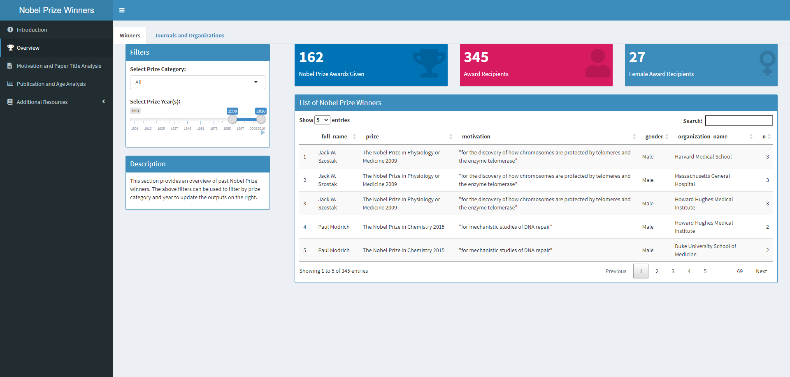
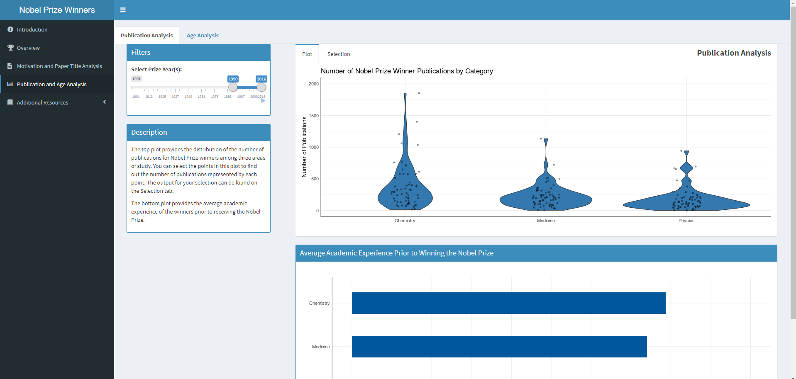

# Shiny Application Project

## Overview

The goal of this project was to build a shiny application that could provide a general overview of previous Nobel Prize winners. Creating a tool that could be used to assist institutions with future decisions regarding who to award the Nobel Prize.

First, a general overview of Nobel Prize winners as well as the journals and organizations associated with those winners was provided. 

Next, an analysis of previous award motivations and titles of winning papers was provided to understand the drivers of previous Nobel Prize awards. 

Finally, additional information about Nobel Prize winners was analyized such the number of publications they had, average years of academic experience, and age. 

All of this information can help us better understand previous Nobel Prize award winners.

## 🔗 [Link to Shiny App](https://japeterson.shinyapps.io/updated-app/)

## Authors

* Joshua Peterson
* Dipin Kasana
* Kelly O'Shields

## Data Source

Kaggle. Available from: https://www.kaggle.com/datasets/nobelfoundation/nobel-laureates

## List of Primary Dependencies

shiny, shinydashboard, tidytext, wordcloud, ggplot2 (Developer Version), RColorBrewer, tidyverse, validate, hrbrthemes, waiter and DT

## 🔗 [Link to Project Code](https://github.com/joshapeterson/My-Portfolio/blob/main/shiny-application-project/app.R)

*[Back to Portfolio](https://github.com/joshapeterson/My-Portfolio)*
